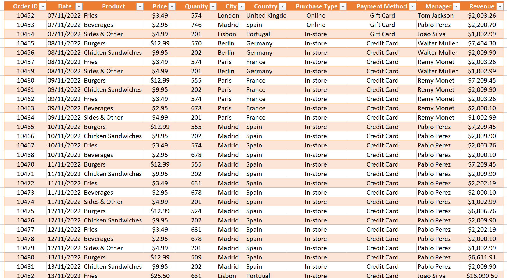
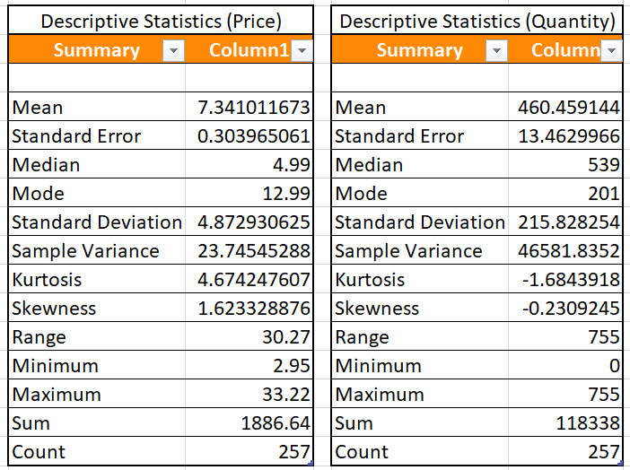
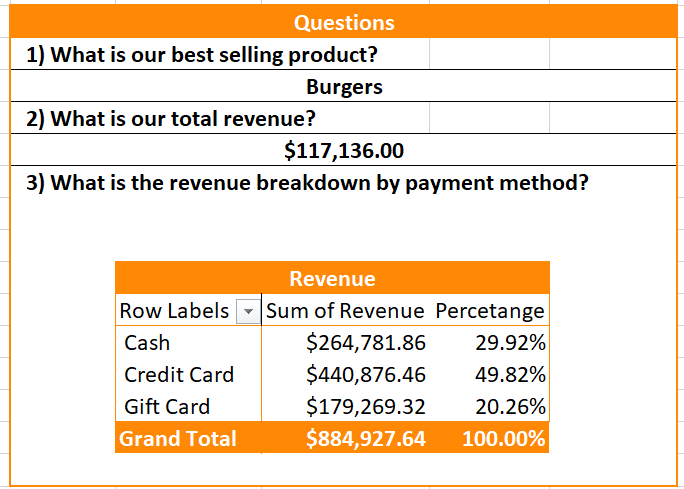
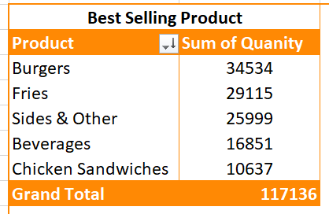

  
Banner <a href="https://stock.adobe.com/ph/search?k=fast+food+restaurant+interior" target="_blank">source</a>


Badge <a href="https://shields.io/" target="_blank">source</a>

# Key Findings: Fast Food Restaurant Dataset

Pivot Table: Product Sales Analysis
- Best selling products include Burgers, Fries, Sides & Other, Beverages, and Chicken Sandwiches. Revenue streams were analyzed based on payment types, including Cash, Credit Card, and Gift Card.

Pivot Table: Manager and Country Insights
- Top-performing products were identified by Manager and Country, providing insights into regional and managerial success in driving sales.

Descriptive Statistics
- Descriptive statistics on Price and Quantity were calculated to understand distribution trends and variations in product pricing and quantities sold.

Chart: Box and Whisker Plot
- Price distribution and variability were visualized through a Box and Whisker Chart, highlighting key data points such as median, quartiles, and outliers.


<!-- Authors -->
<!-- ## Reference
- Learn 80% of Data Analysis in Excel in Just 12 Minutes ( https://www.youtube.com/watch?v=O1QfG5SXRkM) -->

## Table of Contents

  - [Key Findings: Fast Food Restaurant Dataset](#key-findings-fast-food-restaurant-dataset)
  - [Table of Contents](#table-of-contents)
  - [Business Problem](#business-problem)
  - [Data source](#data-source)
  - [Methods](#methods) 
  - [Tech Stack](#tech-stack)
  - [Summary of Key Results](#summary-of-key-results)
  - [Lessons Learned and Recommendation](#lessons-learned-and-recommendation)
  - [Limitation and What Can Be Improved](#limitation-and-what-can-be-improved)
  - [Run Locally](#run-locally)
  - [Repository Structure](#repository-structure)
  - [Contribution](#contribution)
  - [License](#license)

## Business Problem
The fast food restaurant needs to identify its best-selling products and understand how payment methods (Cash, Credit Card, Gift Card) impact revenue. Additionally, performance variations across managers and countries need to be assessed to enhance operational efficiency.

By analyzing product sales, payment preferences, and regional performance, the business aims to optimize pricing strategies, improve product offerings, and boost overall revenue.

## Data Source

- Master Data Analysis on Excel in Just 10 Minutes (https://www.youtube.com/watch?v=_g5roKHj95o)

## Methods

- Data Transformation
- Pivot Table Analysis (Best Selling Products, Revenue by Payment Type, Manager & Country Performance)
- Descriptive Statistics (Price and Quantity)
- Data Visualization (Box and Whisker Plot for Price Distribution)

## Tech Stack

- Microsoft Excel
  - Data Transformation
  - Pivot Tables
  - Descriptive Statistics
  - Charting & Data Visualization (Box and Whisker Plot)


## Summary of Key Results

<div align="center">
  <h4>Dashboard</h4>
  

  <h4>Working Sheet</h4>
  

  <h4>Descriptive Statistics (Price and Quantity)</h4>
  

  <h4>Data Analysis Questions</h4>
  

  <h4>Bestselling Product</h4>
  

  <h4>Revenue by Payment Type</h4>
  

  <h4>Manager and Country Performance</h4>
  

  <h4>Box and Whisker</h4>
  
</div>


## Lessons Learned and Recommendation
Through data analysis, it was found that best-selling products like Burgers, Fries, and Beverages drive significant revenue, suggesting a focus on product-specific promotions. Payment methods also impact revenue, with different patterns observed for cash, credit cards, and gift cards, guiding tailored payment strategies.

Performance varies by manager and country, indicating the importance of region-specific strategies to enhance efficiency. Box and whisker plots revealed insights into price distribution, helping to refine pricing by identifying optimal price ranges and outliers.

Recommendation: 
  1. Focus on Top Products: Prioritize marketing and upsell strategies for best-selling items like Burgers and Beverages, which contribute most to revenue. Customization of promotions can further boost these product categories.

  2. Optimize Payment Systems: Tailor payment strategies to maximize revenue, encouraging the use of high-revenue payment methods (e.g., credit cards) through loyalty programs or incentives for gift card usage.

  3. Manager and Regional Performance: Implement regular performance assessments across managers and regions to address underperformance. Introduce regional-specific strategies that account for local preferences and market conditions.

  4. Refine Pricing Strategies: Use descriptive statistics and data visualizations to continuously evaluate product pricing. Adjust prices to stay competitive while maintaining profit margins, focusing on outliers and price sensitivity.

  5. Continue Data-Driven Decision Making: Leverage pivot tables and visualization tools to further analyze trends, identifying new opportunities for product improvement, cost management, and revenue growth.

## Limitation and What Can Be Improved

Limitations
- The analysis was limited by Excel’s capacity for handling large datasets and lacked insights into individual customer behavior or external factors like seasonality and market trends.

Improvements
- Future analysis could benefit from using tools like Power BI or Tableau for more detailed insights. Incorporating customer segmentation and external data (e.g., competitor pricing) would improve decision-making.


## Run Locally
Initialize git

```bash
git init
```


Clone the project

```bash
git clone https://github.com/johncanero/fastfood_chain_dataset_john_canero.git
```

enter the project directory

```bash
cd fastfood_chain_dataset_john_canero
```

Open in Visual Studio Code

```bash
code .
```

## Repository Structure


```
├── assets
│   ├── Banner_FastFoodRestuaurant_Dataset.png      
│   ├── PivotTable_BestsellingProduct_FastFoodRestaurant.png 
│   ├── PivotTable_ManagerRevenue_FastFoodRestaurant.png
│   ├── PivotTable_Revenue_FastFoodRestaurant.png   
|   ├── Questions_FastFoodRestaurant.png 
│   ├── Statistics_Descriptive_FastFoodRestaurant.png
|   ├── WorkingSheet_FastFoodRestaurant.png
|
|
├── 02_fastfood_chain_dataset_john_canero.xlsx
│ 
│
├── README.md                     
│
│
```

## Contribution

Pull requests are welcome! For major changes, please open an issue first to discuss what you would like to change or contribute.

## License

MIT License

Copyright (c) 2022 Stern Semasuka

Permission is hereby granted, free of charge, to any person obtaining a copy
of this software and associated documentation files (the "Software"), to deal
in the Software without restriction, including without limitation the rights
to use, copy, modify, merge, publish, distribute, sublicense, and/or sell
copies of the Software, and to permit persons to whom the Software is
furnished to do so, subject to the following conditions:

The above copyright notice and this permission notice shall be included in all
copies or substantial portions of the Software.

THE SOFTWARE IS PROVIDED "AS IS", WITHOUT WARRANTY OF ANY KIND, EXPRESS OR
IMPLIED, INCLUDING BUT NOT LIMITED TO THE WARRANTIES OF MERCHANTABILITY,
FITNESS FOR A PARTICULAR PURPOSE AND NONINFRINGEMENT. IN NO EVENT SHALL THE
AUTHORS OR COPYRIGHT HOLDERS BE LIABLE FOR ANY CLAIM, DAMAGES OR OTHER
LIABILITY, WHETHER IN AN ACTION OF CONTRACT, TORT OR OTHERWISE, ARISING FROM,
OUT OF OR IN CONNECTION WITH THE SOFTWARE OR THE USE OR OTHER DEALINGS IN THE
SOFTWARE.

Learn more about [MIT](https://choosealicense.com/licenses/mit
